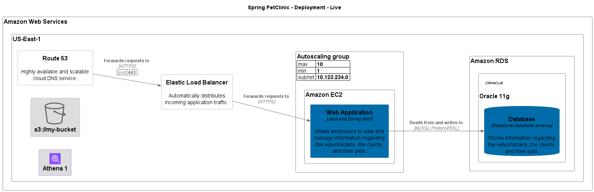

# Spring PetClinic

## System Contexts

### Spring PetClinic - System Context

Description: System Context of Spring PetClinic

[png](../../images/system_context%20Spring%20PetClinic.png) | [svg](../../images/system_context%20Spring%20PetClinic.svg)

## Containers

| Container | Description |
| --- | --- |
| Database | Stores information regarding the veterinarians, the clients, and their pets. |
| Web Application | Allows employees to view and manage information regarding the veterinarians, the clients, and their pets. |

### Spring PetClinic - Containers

Description: Container view of Spring PetClinic

[png](../../images/container%20Spring%20PetClinic.png) | [svg](../../images/container%20Spring%20PetClinic.svg)

## Relationships

### Used By

| Element | Description | Tags |
| --- | --- | --- |
| [Web Service 4](../../../software-systems/App%202/Web%20Application%202_%20_______à_èéìù_/README.md) |  | Element,Component |
| [Web Application 2:     % &à\èéìù/](../../../software-systems/App%202/Web%20Application%202_%20_______à_èéìù_/README.md) |  | Element,Container,Application |
| [App 2](../../../software-systems/App%202/README.md) |  | Element,Software System |
| User |  | Element,Person |

## Deployments

### Spring PetClinic - Deployment - Live

[png](../../images/AmazonWebServicesDeployment.png) | [svg](../../images/AmazonWebServicesDeployment.svg)

