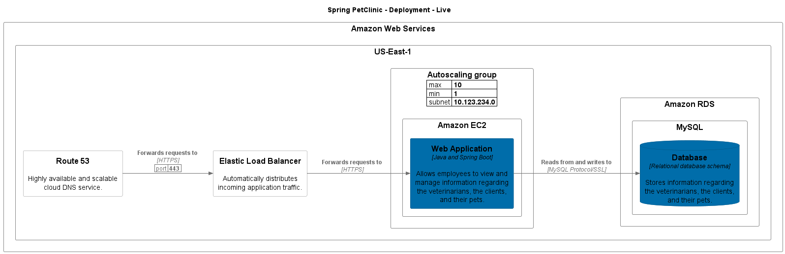

# Spring PetClinic

## System Contexts

### Spring PetClinic - System Context

Description: System Context of Spring PetClinic

[png](../../images/system_context%20Spring%20PetClinic.png) | [svg](../../images/system_context%20Spring%20PetClinic.svg)

## Containers

| Container | Description |
| --- | --- |
| Database | Stores information regarding the veterinarians, the clients, and their pets. |
| Web Application | Allows employees to view and manage information regarding the veterinarians, the clients, and their pets. |

### Spring PetClinic - Containers

Description: Container view of Spring PetClinic

[png](../../images/container%20Spring%20PetClinic.png) | [svg](../../images/container%20Spring%20PetClinic.svg)

## Relationships

### Called by

| Source Software System | Source Container | Source Component | Target Software System | Target Container | Target Component | Description |
| --- | --- | --- | --- | --- | --- | --- |
| App 2 | Web Application 2: %$&à\èéìù/ | Web Service 4 | Spring PetClinic | Web Application |  | test 1 |
| App 2 | Web Application 2: %$&à\èéìù/ | Web Service 4 | Spring PetClinic | Web Application | Web Service 1 | test 2 |
| App 2 | Web Application 2: %$&à\èéìù/ | Web Service 4 | Spring PetClinic | Web Application | Web Service 2 | test 1 |
| App 2 | Web Application 2: %$&à\èéìù/ | Web Service 4 | Spring PetClinic |  |  | test 1 |
| App 2 | Web Application 2: %$&à\èéìù/ |  | Spring PetClinic | Web Application |  | test 1 |
| App 2 | Web Application 2: %$&à\èéìù/ |  | Spring PetClinic | Web Application | Web Service 1 | test 2 |
| App 2 | Web Application 2: %$&à\èéìù/ |  | Spring PetClinic | Web Application | Web Service 2 | test 1 |
| App 2 | Web Application 2: %$&à\èéìù/ |  | Spring PetClinic |  |  | test 1 |
| App 2 |  |  | Spring PetClinic | Web Application |  | test 1 |
| App 2 |  |  | Spring PetClinic | Web Application | Web Service 1 | test 2 |
| App 2 |  |  | Spring PetClinic | Web Application | Web Service 2 | test 1 |
| App 2 |  |  | Spring PetClinic |  |  | test 1 |
| Spring PetClinic | Web Application | Web Service 1 | Spring PetClinic | Database |  | Reads from and writes to |
| Spring PetClinic | Web Application | Web Service 2 | Spring PetClinic | Web Application | Web Service 1 |  |
| Spring PetClinic | Web Application |  | Spring PetClinic | Database |  | Reads from and writes to |
| User |  |  | Spring PetClinic | Web Application |  | Access to user data |
| User |  |  | Spring PetClinic | Web Application | Web Service 2 | Access to user data |
| User |  |  | Spring PetClinic |  |  | Access to user data |

### Calls

| Source Software System | Source Container | Source Component | Target Software System | Target Container | Target Component | Description |
| --- | --- | --- | --- | --- | --- | --- |
| Spring PetClinic | Web Application | Web Service 1 | Spring PetClinic | Database |  | Reads from and writes to |
| Spring PetClinic | Web Application | Web Service 2 | Spring PetClinic | Web Application | Web Service 1 |  |
| Spring PetClinic | Web Application |  | Spring PetClinic | Database |  | Reads from and writes to |

## Deployments

### Spring PetClinic - Deployment - Live

[png](../../images/AmazonWebServicesDeployment.png) | [svg](../../images/AmazonWebServicesDeployment.svg)

