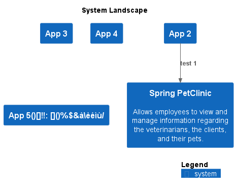

# Landscape

[png](./images/landscape.png) | [svg](./images/landscape.svg)

## Software Systems

 - [App 2](software-systems/App%202/README.md)
 - [Spring PetClinic](software-systems/Spring%20PetClinic/README.md)

## Stats

### Software Systems

| Software System | # Containers | # Components |
| --- | --- | --- |
| App 2 | 2 | 2 |
| Spring PetClinic | 2 | 2 |

### Containers

| Software System | Container | # Components |
| --- | --- | --- |
| App 2 | Database | 0 |
| App 2 | Web Application | 2 |
| Spring PetClinic | Database | 0 |
| Spring PetClinic | Web Application | 2 |

## Relations

| Software System | # |
| --- | --- |
| App 2 | 5 |
| Spring PetClinic | 0 |

| Software System | Container | # |
| --- | --- | --- |
| App 2 | Database | 0 |
| App 2 | Web Application | 5 |
| Spring PetClinic | Database | 0 |
| Spring PetClinic | Web Application | 1 |

| Software System | Container | Component | # |
| --- | --- | --- | --- |
| App 2 | Web Application | Web Service 3 | 3 |
| App 2 | Web Application | Web Service 4 | 4 |
| Spring PetClinic | Web Application | Web Service 1 | 1 |
| Spring PetClinic | Web Application | Web Service 2 | 1 |

