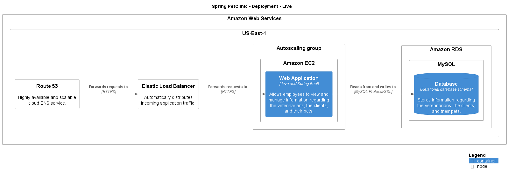

# Spring PetClinic

## System Contexts

### Spring PetClinic - System Context

[png](images/app1_sc.png) | [svg](images/app1_sc.svg)

## Containers

### Title 123

[png](images/app1_ct.png) | [svg](images/app1_ct.svg)

## Component Diagrams

### Spring PetClinic - Database - Components

[png](images/app1_database_c.png) | [svg](images/app1_database_c.svg)
### Spring PetClinic - Web Application - Components

[png](images/app1_webapp_c.png) | [svg](images/app1_webapp_c.svg)

## Deployments

### Spring PetClinic - Deployment - Live

[png](images/AmazonWebServicesDeployment.png) | [svg](images/AmazonWebServicesDeployment.svg)

