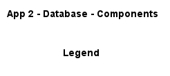
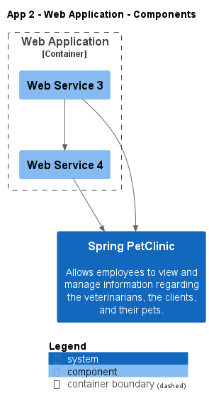

# App 2

## System Contexts

### App 2 - System Context

description: System context description...
image app2_sc -> ..\..\images\app2_sc.png

image app2_sc -> ..\..\images\app2_sc.svg

## Containers

### App 2 - Containers

image app2_ct -> ..\..\images\app2_ct.png

image app2_ct -> ..\..\images\app2_ct.svg

## Component Diagrams

### App 2 - Database - Components

image app2_database_c -> ..\..\images\app2_database_c.png

image app2_database_c -> ..\..\images\app2_database_c.svg

### App 2 - Web Application - Components

image app2_webapp_c -> ..\..\images\app2_webapp_c.png

image app2_webapp_c -> ..\..\images\app2_webapp_c.svg

## Deployments

