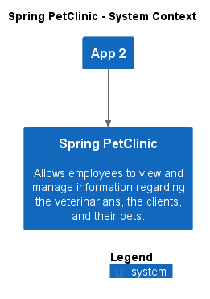
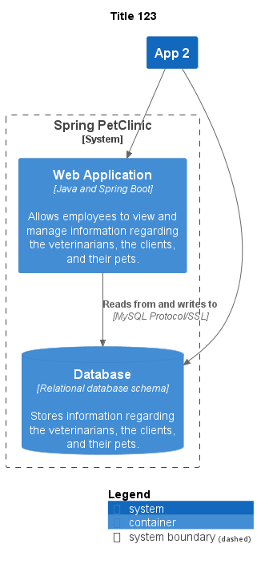
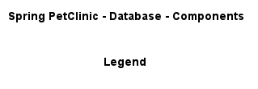
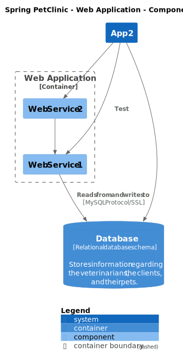
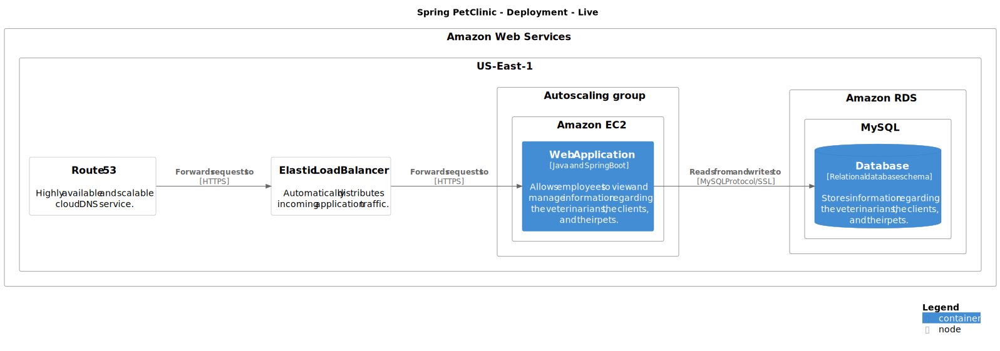

# Spring PetClinic

## System Contexts

### Spring PetClinic - System Context

image app1_sc -> ..\..\images\app1_sc.png

image app1_sc -> ..\..\images\app1_sc.svg

## Containers

### Title 123

image app1_ct -> ..\..\images\app1_ct.png

image app1_ct -> ..\..\images\app1_ct.svg

## Component Diagrams

### Spring PetClinic - Database - Components

image app1_database_c -> ..\..\images\app1_database_c.png

image app1_database_c -> ..\..\images\app1_database_c.svg

### Spring PetClinic - Web Application - Components

image app1_webapp_c -> ..\..\images\app1_webapp_c.png

image app1_webapp_c -> ..\..\images\app1_webapp_c.svg

## Deployments

### Spring PetClinic - Deployment - Live

image AmazonWebServicesDeployment -> ..\..\images\AmazonWebServicesDeployment.png

image AmazonWebServicesDeployment -> ..\..\images\AmazonWebServicesDeployment.svg

